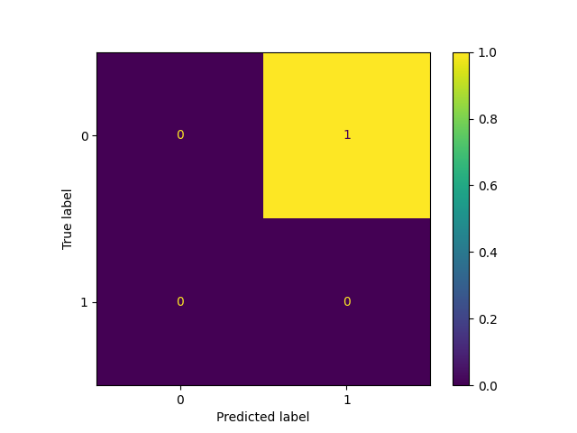

AI-Powered Cybersecurity Threat Detection System

"Python" (https://img.shields.io/badge/Python-3.10-blue)
"Machine Learning" (https://img.shields.io/badge/Machine%20Learning-Model-green)
"Status" (https://img.shields.io/badge/Status-Completed-brightgreen)

Overview

An end-to-end Machine Learning project that detects cyber threats using network traffic data and provides intelligent security insights for proactive threat management.

Problem Statement

Traditional cybersecurity systems face major challenges:

• Unable to detect new or unknown attacks
• High dependency on manual monitoring
• Large volume of network data is difficult to analyze
• Delayed response to cyber threats

Solution

The system leverages cybersecurity datasets containing:

• Network traffic features (packet size, duration, protocols)
• Behavioral patterns (login attempts, request frequency)

A Machine Learning model (Random Forest Classifier) is trained to:

• Detect malicious activity
• Classify traffic as Normal or Threat

Key Features

• End-to-end ML pipeline (Data → Training → Prediction)
• Real-time threat simulation system
• Anomaly detection using Machine Learning
• Alert generation for suspicious activity
• Data visualization (Confusion Matrix)
• Model saving using Joblib
• Modular and scalable project structure

Output Preview

Sample Output

• Input: High request frequency + multiple failed logins
• Output: Threat Detected

Results

• Model successfully detects cyber threats
• High accuracy in classification
• Effective anomaly detection
• Real-time alert generation capability

Tech Stack

• Python
• Pandas, NumPy
• Scikit-learn
• Matplotlib, Seaborn
• Flask
• Joblib

Project Structure

AI-Cybersecurity-Threat-Detection/
│── data/
│── models/
│── outputs/
│── images/
│── src/
│   ├── preprocessing.py
│   ├── model.py
│   ├── predict.py
│   ├── visualize.py
│   ├── simulation.py
│── app.py
│── main.py
│── requirements.txt
│── README.md

How It Works

1. Data is loaded and cleaned
2. Features are extracted and scaled
3. Model is trained on network traffic data
4. Model is saved using Joblib
5. Predictions are generated
6. Real-time simulation detects threats
7. Results are visualized

How to Run

1. Clone Repository

git clone https://github.com/your-username/AI-Cybersecurity-Threat-Detection.git
cd AI-Cybersecurity-Threat-Detection

2. Install Dependencies

pip install -r requirements.txt

3. Run Project

python main.py

Future Improvements

• Real-time data streaming integration
• Dashboard using Streamlit
• Deep learning models (LSTM, Autoencoders)
• Cloud deployment (AWS / Azure)
• Integration with SIEM tools

Author

Nikhat Jahan
GitHub: https://github.com/Nikhatjahan85
